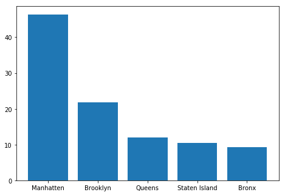

# The Watchers of NYC

## Main

**Welcome to my Project Website!**

### Overview:

The objective of my project was to use data on animal encounters in NYC to create visualizations that may urge site visitors to seek out their local wildlife. Personally, I was curious about the nature of these animals in New York. These silent watchers that have observed and adapted to centuries of human activity. Using some of the most popular python libraries, I have created several visualizations that I hope will impart some glint of knowledge to anyone viewing this site.

### The Libraries I used:
```
#Python Libraries:
import pandas as pd
import numpy as np
import matplotlib.pyplot as plt
from collections import Counter
import folium
```

With the proper libraries loaded, we can now read the dataset I chose:
```
#read dataset
df = pd.read_csv('Urban_Park_Ranger_Animal_Condition_Response.csv')
```

Now we move onto preprocessing the data:

### Preprocessing the Data:
```
#return dataframe of necessary features
df = df[['Date and Time of initial call', 'Borough', 'Property', 'Species Description', 'Species Status', 'Animal Class', '# of Animals']]
#drop all nans
df.dropna()

#standardize all species descriptions for easier grouping
#small additional edits were made to standardize all non-formal entries/spelling errors
df['Species Description'] = df['Species Description'].str.title()
df['Species Status'] = df['Species Status'].replace(np.nan, 'Other')

#output to new file
df.to_csv('WatchersFin.csv', index=False)
```



