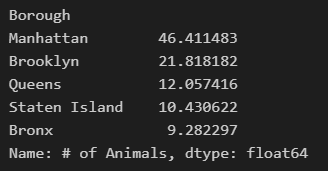
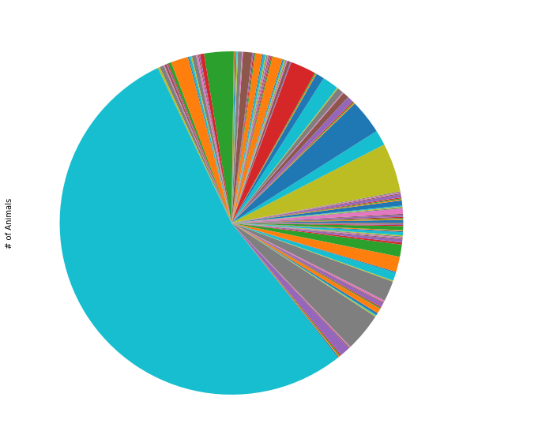
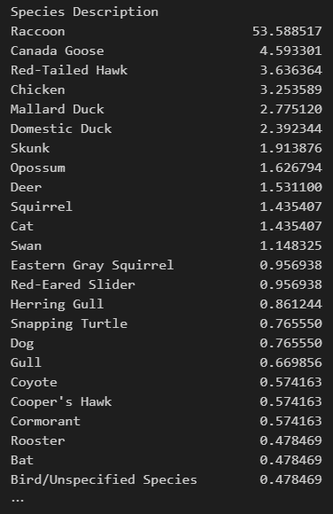
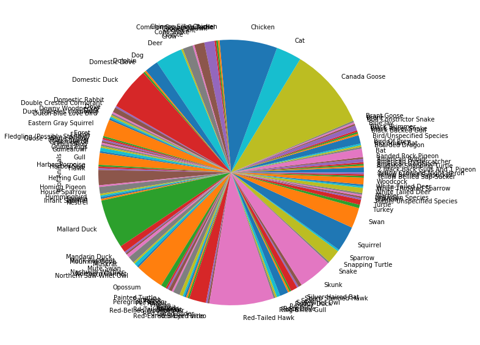
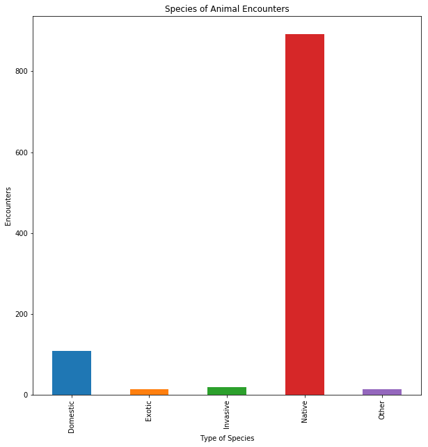
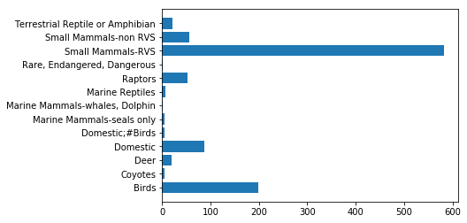

# The Watchers of NYC

## Main

**Welcome to my Project Website!**

### Overview:

The objective of my project was to use data on animal encounters in NYC to create visualizations that may urge site visitors to seek out their local wildlife. Personally, I was curious about the nature of these animals in New York. These silent watchers that have observed and adapted to centuries of human activity. Using some of the most popular python libraries, I have created several visualizations that I hope will impart some glint of knowledge to anyone viewing this site.

### The Libraries I used:
```
#Python Libraries:
import pandas as pd
import numpy as np
import matplotlib.pyplot as plt
from collections import Counter
import folium
```

With the proper libraries loaded, we can now read the dataset I chose:
```
#read dataset
df = pd.read_csv('Urban_Park_Ranger_Animal_Condition_Response.csv')
```

Now we move onto preprocessing the data:

### Preprocessing the Data:

This dataset I have chosen is a compilation of all requests made to and by Urban Park Rangers of NYC. They are called upon to handle encounters with animals should they be in direct or indirect danger to those around them. This is data compile from 2018-2021 and should be updated semi frequently. This is the only source of data I found related to human/animal interaction and location (as well as time) that is updated within NYC. There are many features in this dataset but I will only use a handfull. 
```
#return dataframe of necessary features
df = df[['Date and Time of initial call', 'Borough', 'Property', 'Species Description', 'Species Status', 'Animal Class', '# of Animals']]
#drop all nans
df.dropna()

#standardize all species descriptions for easier grouping
#small additional edits were made to standardize all non-formal entries/spelling errors
df['Species Description'] = df['Species Description'].str.title()
df['Species Status'] = df['Species Status'].replace(np.nan, 'Other')

#output to new file
df.to_csv('WatchersFin.csv', index=False)
```
With preprocessing done, we can now get to work with the data and create visualizations!

### Visualizations:

First, I'd like to see how this data is spread out amongst the boroughs; see if we get a well-spread-out map of activity:
```
#groupby function to see the animal data by percentage by borough
boro_graph = watcher.groupby(['Borough'])['# of Animals'].sum()
top_of_list = boro_graph.sort_values(ascending=False)
perc = top_of_list/sum(top_of_list) * 100
print(perc)
```

```
#bar graph to visualize the split amongst the boroughs oF NYC
fig = plt.figure()
ax = fig.add_axes([0,0,1,1])
x_labels = ['Manhatten', 'Brooklyn', 'Queens', 'Staten Island', 'Bronx']
y_labels = [46.411483, 21.818182, 12.057416, 10.430622, 9.282297]
ax.bar(x_labels, y_labels)
plt.show()
```


Well, Manhatten is clearly the most popular spot, I wonder what the animal population is like:
```
#visualizing with pie chart
watcher = watcher.loc[(watcher['# of Animals'] > 0)]
w_graph = watcher.groupby(['Species Description'])['# of Animals'].sum()
w_graph.plot.pie(subplots=True,figsize=(10,10))
plt.show()
```



Ok, I didn't expect raccoons to be this high...
Let's see the raw percentages!

```
#groupby function to see the animal data by percentage
w_graph = watcher.groupby(['Species Description'])['# of Animals'].sum()
top_of_list = w_graph.sort_values(ascending=False)
percentage = top_of_list/sum(top_of_list) * 100
print(percentage)
```



Leading by almost 50%? I wonder what the pie will look like without that large chunk of trash panda...

```
#visualizing with pie chart (once more!)
watcher = watcher.loc[(watcher['# of Animals'] > 0)]
w_graph = watcher.groupby(['Species Description'])['# of Animals'].sum()
w_graph.plot.pie(subplots=True,figsize=(10,10))
plt.show()
```



There are far too many labels for this pie, let us take a look at something else.
Let's check how these animals are classified:

```
#species classification
w_graph = watcher.groupby(['Species Status'])['# of Animals'].sum()
w_graph.plot.bar(subplots=True,figsize=(10,10))
plt.title('Species of Animal Encounters')
plt.xlabel('Type of Species')
plt.ylabel('Encounters')
plt.show()
```
This supports my initial assumtion that the majority of these animal encounters are native and have adapted to NYC.


Let's check one more thing:
```
#Horizontal bar graph for animal classes
classes = ['Birds', 'Coyotes', 'Deer', 'Domestic', 'Domestic;#Birds', 'Marine Mammals-seals only', 'Marine Mammals-whales, Dolphin', 'Marine Reptiles', 'Raptors', 'Rare, Endangered, Dangerous', 'Small Mammals-RVS', 'Small Mammals-non RVS', 'Terrestrial Reptile or Amphibian']
num_animals = [198,6,20,87,6,5,2,7,53,1,582,56,22]
y_label = np.arange(len(classes))
plt.barh(y_label, num_animals)
plt.yticks(y_label, classes)
plt.show()
```


So, it's _clear_ these visualizations all point to a singular conclusion:

## Conclusion: (TLDR:)

**THE STREETS OF NEW YORK BELONG TO TRASH PANDAS**

In all honesty, I believe that the only reason raccoons are reported so high is because most people don't want to deal with them. Fear of rabies and general uncleanliness from going through other people's trash generally tends to sway people away. However, I think that, despite whatever bias one may have against them, they are a model survivor in the concrete jungle that is NYC.


